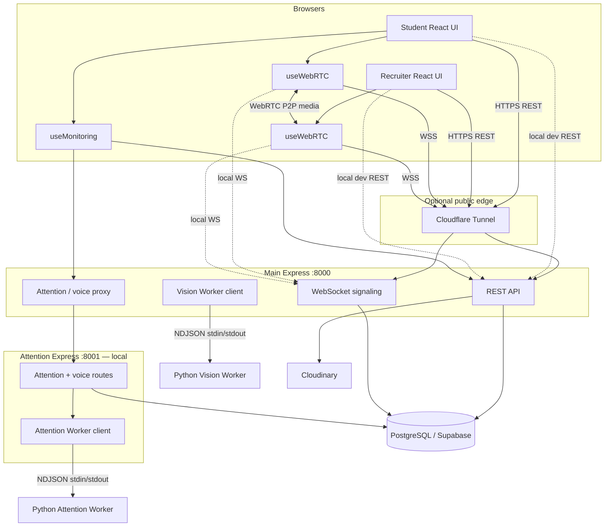

# HIRELENS — Technical Documentation

**HIRELENS** (InterviewAI) is an AI-proctored remote interview platform. Recruiters create monitored interviews; students join via WebRTC video calls while computer-vision and voice models detect integrity violations in real time.

**Repository:** [github.com/eryadavpraveen/HIRELENS](https://github.com/eryadavpraveen/HIRELENS)  
**LinkedIn:** [click here to see my linkedin post](https://www.linkedin.com/posts/eryadavpraveen_hirelens-softwareengineering-fullstackdevelopment-ugcPost-7477014565894139904-o7_-/?utm_source=share&utm_medium=member_desktop&rcm=ACoAADSw_ioBk2LmAm8RjwFzb-7SxfCnunP3-OI)

---

## Table of contents

1. [System overview](#1-system-overview)
2. [Architecture](#2-architecture)
3. [Repository structure](#3-repository-structure)
4. [Technology stack](#4-technology-stack)
5. [Authentication & security](#5-authentication--security)
6. [Database](#6-database)
7. [Backend API (port 8000)](#7-backend-api-port-8000)
8. [Cloudinary / verification storage](#8-cloudinary--verification-storage)
9. [Attention service (port 8001)](#9-attention-service-port-8001)
10. [Python ML workers](#10-python-ml-workers)
11. [WebRTC & signaling](#11-webrtc--signaling)
12. [Monitoring pipeline](#12-monitoring-pipeline)
13. [Fullscreen & environment proctoring](#13-fullscreen--environment-proctoring)
14. [Violations & integrity score](#14-violations--integrity-score)
15. [Frontend application](#15-frontend-application)
16. [End-to-end user flows](#16-end-to-end-user-flows)
17. [Environment variables](#17-environment-variables)
18. [Local development](#18-local-development)
19. [Cloudflare Tunnel](#19-cloudflare-tunnel)
20. [Deployment](#20-deployment)
21. [Troubleshooting](#21-troubleshooting)
22. [License & links](#22-license--links)

---

## 1. System overview

HIRELENS splits work across **browser clients**, two **Express/Node.js** services, and two **persistent Python ML workers**:

| Component | Role | Default |
|-----------|------|---------|
| **Frontend** | React + Vite SPA — recruiter & student UI | `5173` (dev) / Vercel (prod) |
| **Main Backend** | Express — REST API, WebSocket signaling, Cloudinary, attention proxy | `8000` |
| **Attention Service** | Express — attention analysis + voice register/verify APIs | `8001` (local / internal) |
| **Vision Worker** | Persistent Python process — face / identity / YOLO | Spawned by Main Express |
| **Attention Worker** | Persistent Python process — MediaPipe + Resemblyzer | Spawned by Attention Express |
| **PostgreSQL** | Users, interviews, participants, violations, tokens, voiceprints | Supabase |
| **Cloudinary** | Verification photo storage | Cloud |
| **Cloudflare Tunnel** | Optional public HTTPS/WSS to Main Express only | Ephemeral `*.trycloudflare.com` |

**Design principles:**

- **HTTP / business logic / auth / WebSocket** run in **Express (Node.js)**.
- **ML inference** runs in **Python workers** only — not as a Python web framework or HTTP server.
- Workers are started with `child_process.spawn` and talk over **stdin/stdout NDJSON**, so heavy models stay warm in memory.
- **Video/audio media** flows peer-to-peer via WebRTC (not through the server).
- **Signaling** (SDP / ICE) and **live monitoring events** flow through the Main Express WebSocket relay.
- The browser talks to **Main Express** for REST and WebSocket. Attention/voice calls go through Main’s **proxy** to Attention Express (`:8001`).

---

## 2. Architecture



**Live interview request paths:**

1. Student webcam frames → Main Express (`/cv`, `/identity`, `/object-detection`) → Vision Worker.
2. Attention frames → Main Express (`/attention/analyze`) → Attention Express → Attention Worker.
3. Voice clips → Main Express (`/voice/*`) → Attention Express → Attention Worker + `voiceprints` table.
4. Detected events → `POST /violations/` (PostgreSQL) + WebSocket `monitoring-event` to the recruiter.
5. Student ↔ recruiter video/audio → direct WebRTC; server only relays SDP/ICE.

---

## 3. Repository structure

```
HIRELENS/
├── frontend/                      # React + Vite + Redux SPA
│   ├── src/
│   │   ├── pages/                 # Auth, Student, Recruiter, Reports, Landing
│   │   ├── hooks/                 # useWebRTC, useMonitoring, useAuth
│   │   ├── services/              # api, monitoring, webrtc, violations, …
│   │   ├── features/              # Redux slices
│   │   ├── components/
│   │   ├── routes/
│   │   └── utils/                 # violations.js integrity engine
│   ├── vercel.json
│   └── .env.example
├── backend-node/                  # Main Express API + WS + Vision Worker
│   ├── src/
│   │   ├── routes/
│   │   ├── services/              # auth, Cloudinary, cleanup, …
│   │   ├── middleware/
│   │   ├── ml/                    # NDJSON worker client
│   │   └── ws/signaling.js
│   ├── prisma/schema.prisma
│   ├── python_vision_worker/      # ML worker + yolov8n.pt
│   ├── scripts/                   # integration / tunnel helpers
│   ├── Dockerfile
│   ├── .env.example
│   └── package.json
├── attention-node/                # Attention Express + Attention Worker
│   ├── src/
│   │   ├── routes/                # attention, voice
│   │   ├── services/
│   │   └── ml/
│   ├── prisma/schema.prisma
│   ├── python_attention_worker/   # ML worker + models/face_landmarker.task
│   ├── Dockerfile
│   ├── .env.example
│   └── package.json
├── deploy/                        # Cloudflare Tunnel helpers
│   ├── cloudflare/config.example.yml
│   ├── CLOUDFLARE_TUNNEL.md
│   ├── start-tunnel.ps1
│   ├── start-tunnel.bat
│   └── validate-tunnel.mjs
├── docs/                          # Additional / historical docs
├── MIGRATION_EXPRESS.md           # Migration notes
└── README.md                      # this file
```

---

## 4. Technology stack

| Layer | Technologies |
|-------|----------------|
| Frontend | React, Vite, Redux Toolkit, React Router, Tailwind, Axios, WebRTC |
| Main API | Node.js, Express, Prisma, JWT (`jsonwebtoken`), `ws`, Multer, Cloudinary SDK, Nodemailer (optional SMTP) |
| Attention API | Node.js, Express, Prisma, JWT |
| Vision ML | Python worker — OpenCV, DeepFace, Ultralytics YOLO, TensorFlow / PyTorch (as required by those libs) |
| Attention ML | Python worker — MediaPipe FaceLandmarker, Resemblyzer, OpenCV, PyTorch, librosa / webrtcvad |
| Worker bridge | `child_process.spawn`, stdin/stdout, NDJSON request/response |
| Database | PostgreSQL (Supabase) via Prisma |
| Media storage | Cloudinary (verification JPEGs) |
| Public edge | Cloudflare Tunnel (`cloudflared`) → Main Express `:8000` |

Python is **not** the HTTP/API layer. It only runs ML workers attached to Express.

---

## 5. Authentication & security

Implemented in **Main Express** (`backend-node/src/routes/auth.js`, `middleware/auth.js`, `services/tokenService.js`).

| Method | Endpoint | Auth | Description |
|--------|----------|------|-------------|
| `POST` | `/auth/register` | Public | Create user (`name`, `email`, `password`, `role`: `student` \| `recruiter`) |
| `POST` | `/auth/login` | Public | Returns `access_token`, `refresh_token`, `token_type: "bearer"` |
| `GET` | `/auth/me` | Bearer | Current user `{ id, name, email, role }` |
| `POST` | `/auth/refresh` | Public | Body `{ refresh_token }` → new token pair (rotation) |
| `POST` | `/auth/logout` | Public | Optional `{ refresh_token }` — revoke refresh token |
| `POST` | `/auth/forgot-password` | Public | Body `{ email }` — sends reset email when SMTP configured |
| `POST` | `/auth/reset-password` | Public | Body `{ token, password }` |

**Access JWT**

- Signed with `SECRET_KEY`, algorithm `ALGORITHM` (default `HS256`).
- Claims include `sub` (user id), `role`, `type: "access"`.
- Lifetime: `ACCESS_TOKEN_EXPIRE_MINUTES` (default `120`).

**Refresh tokens**

- Opaque random values stored as SHA-256 hashes in `refresh_tokens`.
- Lifetime: `REFRESH_TOKEN_EXPIRE_DAYS` (default `30`).
- Refresh **rotates** the token (old hash revoked).

**Authorization**

- `requireAuth` — valid Bearer access JWT.
- `requireRecruiter` / `requireStudent` — role gates.
- Interview ownership checks for recruiter; participant membership for students.
- Attention Express validates the same JWT secret for voice routes (student + participant for `candidate_id`).

**CORS**

- Built from `FRONTEND_URL`, `CORS_ORIGINS`, optional `CORS_ORIGIN_REGEX`, plus defaults for localhost, Vercel, and `*.trycloudflare.com`.

---

## 6. Database

**ORM:** Prisma → PostgreSQL / Supabase.

Schemas:

- Main: `backend-node/prisma/schema.prisma`
- Attention: `attention-node/prisma/schema.prisma` (subset: `User`, `Participant`, `Voiceprint` for JWT + voiceprints)

| Table / model | Purpose |
|---------------|---------|
| `users` | Accounts (`name`, `email`, `passwordHash`, `role`) |
| `interviews` | Sessions created by recruiters (`title`, `status`, times, `completedAt`) |
| `participants` | Student membership; `verificationPhoto` stores **Cloudinary secure URL** |
| `violations` | Persisted proctoring events (`type`, `duration`, `confidence`, `timestamp`) |
| `refresh_tokens` | Hashed refresh tokens |
| `password_reset_tokens` | Hashed reset tokens |
| `voiceprints` | Voice embedding JSON keyed by `candidateId` |

**Prisma commands (current):**

```powershell
cd backend-node   # or attention-node
npx prisma generate
# Optional against a live DB:
npx prisma db pull
```

Application code expects an already-provisioned schema compatible with these models.

---

## 7. Backend API (port 8000)

Base URL: `http://127.0.0.1:8000` (or Cloudflare HTTPS URL).  
Health: `GET /` → `{ "message": "InterviewAI Backend Running" }`.

### Authentication

See [§5](#5-authentication--security).

### Interview lifecycle

| Method | Endpoint | Auth | Description |
|--------|----------|------|-------------|
| `POST` | `/interviews/` | Recruiter | Create interview |
| `GET` | `/interviews/` | Authenticated | List (role-scoped) |
| `GET` | `/interviews/:id` | Owner / participant | Detail |
| `GET` | `/interviews/:id/join-preview` | Student | Preview before join |
| `POST` | `/interviews/:id/join` | Student | Join / create participant |
| `PATCH` | `/interviews/:id/complete` | Authenticated | Mark completed (`reason` may be `TAB_SWITCH`) |
| `DELETE` | `/interviews/:id` | Recruiter | Cascade cleanup (DB + Cloudinary + voiceprints + WS eviction) |

### Participants & candidates

| Method | Endpoint | Auth | Description |
|--------|----------|------|-------------|
| `GET` | `/interviews/:id/participants` | Owner / participant | List participants |
| `GET` | `/candidates/` | Recruiter | Candidate rollup across interviews |

### Verification & identity

| Method | Endpoint | Auth | Description |
|--------|----------|------|-------------|
| `POST` | `/verification/upload` | Student | Upload verification photo → Cloudinary; save URL on participant |
| `POST` | `/identity/verify-identity` | Student | Compare live frame to stored photo (Vision Worker) |

### Computer vision & objects

| Method | Endpoint | Auth | Description |
|--------|----------|------|-------------|
| `POST` | `/cv/check-face` | Student | Face count / presence (Vision Worker) |
| `POST` | `/object-detection/check` | Student | Phone / person / laptop / book flags (YOLO) |

### Violations & reports

| Method | Endpoint | Auth | Description |
|--------|----------|------|-------------|
| `POST` | `/violations/` | Student | Persist a violation event |
| `GET` | `/violations/:interviewId` | Owner / participant | List events |
| `GET` | `/reports/` | Recruiter | Interview report list |
| `GET` | `/reports/:reportId` | Recruiter | Single report |
| `POST` | `/reports/generate/:interviewId` | Recruiter | Generate / refresh report payload |

### Attention proxy (public surface on Main)

| Method | Endpoint | Auth | Description |
|--------|----------|------|-------------|
| `POST` | `/attention/analyze` | Public multipart | Proxy → Attention Express |
| `POST` | `/voice/register` | Forwards `Authorization` | Proxy → Attention Express |
| `POST` | `/voice/verify` | Forwards `Authorization` | Proxy → Attention Express |

### Signaling

| Protocol | Path | Description |
|----------|------|-------------|
| WebSocket | `/ws/interview/:interviewId?role=recruiter\|student` | SDP/ICE + monitoring relay |

---

## 8. Cloudinary / verification storage

Verification images are **not** kept as permanent local disk files for production storage. They are uploaded to **Cloudinary**.

| Variable | Purpose |
|----------|---------|
| `CLOUDINARY_CLOUD_NAME` | Cloud name |
| `CLOUDINARY_API_KEY` | API key |
| `CLOUDINARY_API_SECRET` | API secret |
| `CLOUDINARY_FOLDER` | Root folder (default `hirelens_images`) |

**Public ID convention** (`backend-node/src/services/cloudinaryService.js`):

```text
${CLOUDINARY_FOLDER}/verification/{candidateId}
```

Example: `hirelens_images/verification/<uuid>`

**Behavior:**

- Upload uses `overwrite: true` and `invalidate: true` so re-verification replaces the same asset.
- Response `secure_url` is stored on `participants.verification_photo`.
- Identity verification may **download** that URL temporarily for DeepFace comparison.
- Interview delete / cleanup destroys Cloudinary assets using the same deterministic `public_id` helper (interview id and/or student id conventions used by the FE).

---

## 9. Attention service (port 8001)

**Attention Express** (`attention-node`) is a separate Node process. It is intended to stay **local/internal**. The frontend should call Main Express; Main proxies attention/voice.

Health: `GET /` → attention service banner JSON.

| Method | Endpoint | Auth | Description |
|--------|----------|------|-------------|
| `GET` | `/` | Public | Health |
| `POST` | `/attention/analyze` | Public (`file`) | Frame analysis via Attention Worker |
| `POST` | `/voice/register` | Student JWT + participant for `candidate_id` | Store voice embedding |
| `POST` | `/voice/verify` | Same | Compare clip to stored embedding |
| `DELETE` | `/voice/:candidateId` | Currently unauthenticated (cleanup helper) | Remove voiceprint |

Pipeline:

```text
Attention Express → Python Attention Worker (NDJSON)
                 → MediaPipe / Resemblyzer / attention rules
                 → PostgreSQL voiceprints (Prisma)
```

`SECRET_KEY` **must match** Main Express so JWTs validate.

---

## 10. Python ML workers

Workers are long-lived processes. Express starts them at boot and restarts them if they exit.

### Vision Worker (`backend-node/python_vision_worker`)

| Responsibility | Implementation |
|----------------|----------------|
| Face counting | OpenCV cascade / detector modules |
| Identity match | DeepFace |
| Object detection | Ultralytics YOLO (`yolov8n.pt`) |

**Ops** (NDJSON): `count_faces`, `verify_faces`, `detect_objects`, `ping`, `shutdown`.

### Attention Worker (`attention-node/python_attention_worker`)

| Responsibility | Implementation |
|----------------|----------------|
| Face landmarks | MediaPipe `face_landmarker.task` |
| Head / eyes / attention | `head_tracker`, `eye_*`, `attention_engine` |
| Lip sync heuristics | `lipsync_detector` |
| Voice embeddings | Resemblyzer |

**Ops:** `analyze`, `embed`, `ping`, `shutdown`.

### Communication pattern

```text
Express  --spawn-->  python worker.py
         --stdin-->  {"id":"…","op":"detect_objects","payload":{…}}\n
         <--stdout-  {"id":"…","ok":true,"result":{…}}\n
```

This is **not** an HTTP Python server. Stdout is reserved for NDJSON; logs go to stderr.

---

## 11. WebRTC & signaling

**Media:** peer-to-peer WebRTC (camera/microphone).  
**Signaling / monitoring:** WebSocket on Main Express.

**Connect:**

```text
WS_BASE_URL/ws/interview/{interviewId}?role=recruiter|student
```

Optional `token` query, or first message `{ "type": "auth", "token": "<access_token>" }` within 15s.

| Direction | Type | Purpose |
|-----------|------|---------|
| Server → client | `room-joined` | Authenticated into room |
| Server → client | `peer-joined` / `peer-left` | Peer presence |
| Bidirectional relay | `offer`, `answer`, `ice-candidate`, `request-offer` | WebRTC negotiation |
| Bidirectional relay | `monitoring-event`, `status-update` | Live proctoring to recruiter |
| Server → client | `interview-completed` | Terminal state / teardown |
| Server → client | `auth-error` | Auth failure |

TURN/STUN for cross-network media is configured on the frontend via `VITE_TURN_*` (see `.env.example`).

---

## 12. Monitoring pipeline

Implemented primarily in `frontend/src/hooks/useMonitoring.js` + `monitoringService.js`.

| Channel | Interval | Main Express route | Worker |
|---------|----------|--------------------|--------|
| Attention | ~1000 ms | `POST /attention/analyze` | Attention Worker (via proxy) |
| Face | ~2000 ms | `POST /cv/check-face` | Vision Worker |
| Objects | ~3000 ms | `POST /object-detection/check` | Vision Worker |
| Identity | ~4000 ms | `POST /identity/verify-identity` | Vision Worker |
| Voice | ~5 s clip + cooldown | `POST /voice/verify` | Attention Worker (via proxy) |

**Event path:**

```text
Student browser loops
  → Main Express (+ Attention Express when proxied)
  → Python workers
  → WebSocket monitoring-event / status-update
  → Recruiter room UI
```

**Persistence:**

```text
Student browser → POST /violations/ → PostgreSQL
```

Client-side dedupe window: **5 seconds** per event type before re-emitting.

---

## 13. Fullscreen & environment proctoring

Student interview room (`StudentInterviewRoom.jsx`):

| Signal | Behavior |
|--------|----------|
| **Tab switch** (`visibilitychange` / hidden) | Record `TAB_SWITCH`, call `PATCH /interviews/:id/complete` with reason `TAB_SWITCH`, end session |
| **Window blur** | Record `WINDOW_BLUR` (ignored if tab already hidden or within fullscreen-exit suppress window) |
| **Window resize** | Record `WINDOW_RESIZE` (same suppress rules) |
| **Fullscreen exit** | Record `FULLSCREEN_EXIT`, show blocking overlay (`FullscreenExitOverlay`) until fullscreen is restored; suppress cascaded blur/resize for ~3s |

Warnings also flow through the monitoring pipeline (toast + recruiter event + persistence) without exposing student-side analytics.

---

## 14. Violations & integrity score

**Server:** stores raw `type` strings on `violations`.  
**Client integrity engine:** `frontend/src/utils/violations.js`.

### Recruiter categories (11)

| Category key | Label | Severity | Weight |
|--------------|-------|----------|--------|
| `head` | Head Violations | yellow | 1 |
| `eye` | Eye Violations | yellow | 1 |
| `no_face` | No Face Violations | orange | 3 |
| `window` | Window Violations | orange | 2 |
| `fullscreen` | Fullscreen Exit Violations | orange | 3 |
| `object` | Object Violations | red | 5 |
| `multiple_person` | Multiple Person Violations | purple | 6 |
| `voice` | Voice Violations | red | 5 |
| `lipsync` | Lip Sync Violations | red | 4 |
| `identity` | Identity Violations | purple | 8 |
| `tab_switch` | Tab Switch Violations | purple | 4 |

Raw types such as `HEAD_LEFT`, `MULTIPLE_PERSON_FACE`, `MULTIPLE_PERSON_YOLO`, `OBJECT_PHONE`, `FULLSCREEN_EXIT`, `TAB_SWITCH`, etc. are mapped into these categories.

**Dedup:** `MULTIPLE_PERSON_FACE` and `MULTIPLE_PERSON_YOLO` contribute via **max()** into a single multiple-person count.

**Score:** `computeIntegrityScore` → **0–100**.  
**Evaluation bands:** EXCELLENT (≥85), GOOD (≥70), SUSPICIOUS (≥50), HIGH_RISK (&lt;50).

Recruiters see live events, dashboards, and downloadable PDF reports (`pdfGenerator.js`).

---

## 15. Frontend application

| Area | Location |
|------|----------|
| Routes | `frontend/src/routes/AppRoutes.jsx` |
| API client | `services/api.js` → `VITE_API_BASE_URL` |
| WebRTC | `hooks/useWebRTC.js`, `services/webrtcService.js` → `VITE_WS_BASE_URL` |
| Monitoring | `hooks/useMonitoring.js`, `services/monitoringService.js` |
| Auth state | `features/auth/authSlice.js` |
| Integrity UI | `components/monitoring/*`, `utils/violations.js` |
| Mock mode | `VITE_USE_MOCK=true` → `utils/mockData.js` |

### Key routes

| Path | Role |
|------|------|
| `/`, `/login`, `/register`, `/forgot-password`, `/reset-password` | Public / guest |
| `/student/dashboard`, `/student/join`, `/student/history`, `/student/profile` | Student |
| `/student/interview/:id/verify`, `/student/interview/:id` | Student interview |
| `/student/reports`, `/student/reports/:id` | Student reports |
| `/recruiter/dashboard`, `/recruiter/create`, `/recruiter/active`, `/recruiter/candidates`, `/recruiter/profile` | Recruiter |
| `/recruiter/interview/:id` | Recruiter monitoring room |
| `/recruiter/reports`, `/recruiter/reports/:id` | Recruiter reports |

### API configuration

```env
VITE_API_BASE_URL=http://127.0.0.1:8000
VITE_WS_BASE_URL=ws://127.0.0.1:8000
```

`VITE_ATTENTION_SERVICE_URL` exists in `.env.example` / `constants.js` but **monitoring call sites use the Main API base** (attention/voice proxied). Prefer configuring only Main Express URLs in production.

---

## 16. End-to-end user flows

### Recruiter

1. Register / login  
2. Create interview  
3. Open recruiter interview room (WebSocket `role=recruiter`)  
4. Wait for student `peer-joined`  
5. Complete WebRTC offer/answer/ICE  
6. Watch live `monitoring-event` / status updates + integrity widgets  
7. Complete interview / open reports / download PDF  
8. Optionally delete interview (cascades Cloudinary + voiceprints)

### Student

1. Register / login  
2. Join interview (preview → join)  
3. Verification page — photo upload (Cloudinary) + voice registration  
4. Enter interview room — fullscreen + WebRTC + monitoring loops  
5. Environment proctoring (tab / blur / resize / fullscreen)  
6. Session ends on completion or **tab-switch termination**

---

## 17. Environment variables

Never commit real `.env` files. Use the examples below as templates only.

### Main Express — `backend-node/.env.example`

| Variable | Required | Notes |
|----------|----------|-------|
| `PORT` | No | Default `8000` |
| `DATABASE_URL` | Yes | PostgreSQL / Supabase |
| `SECRET_KEY` | Yes | JWT — must match Attention |
| `ALGORITHM` | No | Default `HS256` |
| `ACCESS_TOKEN_EXPIRE_MINUTES` | No | Default `120` |
| `REFRESH_TOKEN_EXPIRE_DAYS` | No | Default `30` |
| `FRONTEND_URL` | No | CORS helper |
| `CORS_ORIGINS` | No | Comma-separated extras |
| `CORS_ORIGIN_REGEX` | No | Optional |
| `ATTENTION_SERVICE_URL` | Yes | `http://127.0.0.1:8001` |
| `ATTENTION_VOICE_TIMEOUT` | No | Seconds (default `120`) |
| `CLOUDINARY_CLOUD_NAME` | Yes | |
| `CLOUDINARY_API_KEY` | Yes | |
| `CLOUDINARY_API_SECRET` | Yes | |
| `CLOUDINARY_FOLDER` | No | Default `hirelens_images` |
| `PYTHON_PATH` | Recommended | Vision worker Python executable |
| `VISION_WORKER_SCRIPT` | No | Override worker script path |
| `SMTP_*` | No | Password-reset email |

### Attention Express — `attention-node/.env.example`

| Variable | Required | Notes |
|----------|----------|-------|
| `PORT` | No | Default `8001` |
| `DATABASE_URL` | Yes | Same DB as Main |
| `SECRET_KEY` | Yes | **Same as Main** |
| `ALGORITHM` | No | Default `HS256` |
| `FRONTEND_URL` / `CORS_*` | No | CORS |
| `PYTHON_PATH` | Recommended | Attention worker Python |
| `ATTENTION_WORKER_SCRIPT` | No | Override worker script path |

### Frontend — `frontend/.env.example`

| Variable | Notes |
|----------|-------|
| `VITE_API_BASE_URL` | Main Express REST |
| `VITE_WS_BASE_URL` | Main Express WebSocket (`ws://` or `wss://`) |
| `VITE_USE_MOCK` | `false` for real API |
| `VITE_ATTENTION_SERVICE_URL` | Optional / unused by monitoring call sites |
| `VITE_TURN_URLS` / `VITE_TURN_USERNAME` / `VITE_TURN_CREDENTIAL` | WebRTC TURN |

---

## 18. Local development

### Prerequisites

- Node.js 20+  
- Python 3.11+ recommended for worker venvs  
- PostgreSQL / Supabase database  
- Cloudinary account  
- Optional: `cloudflared` for public tunnel demos  

### 1) Attention Express (+ Attention Worker)

```powershell
cd attention-node
copy .env.example .env
# Set DATABASE_URL + SECRET_KEY (match Main)

npm install
npx prisma generate

cd python_attention_worker
python -m venv .venv
.\.venv\Scripts\pip install -r requirements.txt
# Ensure models\face_landmarker.task is present
cd ..

# Set PYTHON_PATH to ...\python_attention_worker\.venv\Scripts\python.exe
npm start
```

### 2) Main Express (+ Vision Worker)

```powershell
cd backend-node
copy .env.example .env
# Set DATABASE_URL, SECRET_KEY, CLOUDINARY_*, ATTENTION_SERVICE_URL=http://127.0.0.1:8001

npm install
npx prisma generate

cd python_vision_worker
python -m venv .venv
.\.venv\Scripts\pip install -r requirements.txt
# Ensure yolov8n.pt is present
cd ..

# Set PYTHON_PATH to ...\python_vision_worker\.venv\Scripts\python.exe
npm start
```

Express **automatically spawns** the Python worker. Do not start a separate Python HTTP server.

### 3) Frontend

```powershell
cd frontend
copy .env.example .env
npm install
npm run dev
```

```env
VITE_API_BASE_URL=http://127.0.0.1:8000
VITE_WS_BASE_URL=ws://127.0.0.1:8000
VITE_USE_MOCK=false
```

---

## 19. Cloudflare Tunnel

Public demos expose **only Main Express**:

```text
Internet → Cloudflare Tunnel → http://127.0.0.1:8000 → Main Express
                                      ↓
                         Attention Express :8001 (local)
                                      ↓
                              Python workers (local)
```

**Do not** tunnel `:8001` or worker processes.

```powershell
cd backend-node
npm run tunnel
# or: npm run tunnel:detach
# or: ..\deploy\start-tunnel.ps1
```

Quick tunnels issue a temporary `https://*.trycloudflare.com` URL that **changes on restart**.

Frontend / Vercel after each new URL:

```env
VITE_API_BASE_URL=https://<tunnel-domain>
VITE_WS_BASE_URL=wss://<tunnel-domain>
```

Details: [`deploy/CLOUDFLARE_TUNNEL.md`](deploy/CLOUDFLARE_TUNNEL.md).

---

## 20. Deployment

Current repo deployment artifacts:

| Artifact | Purpose |
|----------|---------|
| `backend-node/Dockerfile` | Node Main + Vision worker venv + `yolov8n.pt` (comments reference container hosts such as Render) |
| `attention-node/Dockerfile` | Node Attention + Attention worker venv + `face_landmarker.task` |
| `deploy/*` | Cloudflare Tunnel helpers for local/public demos |
| `frontend/vercel.json` | Frontend static deploy on Vercel |

**Runtime shape in containers:** Express process starts and spawns the Python worker inside the same service image (`PYTHON_PATH` baked in Dockerfiles). There is no separate Python web server process.

**Required cloud config:**

- `DATABASE_URL` (Supabase / Postgres)
- Shared `SECRET_KEY` across Main + Attention
- `ATTENTION_SERVICE_URL` pointing at the Attention service URL
- `CLOUDINARY_*` including `CLOUDINARY_FOLDER`
- Frontend `VITE_API_BASE_URL` / `VITE_WS_BASE_URL`

ML images (Torch / TF / MediaPipe) are large — plan for sufficient **RAM and disk** on the host.

---

## 21. Troubleshooting

| Symptom | What to check |
|---------|----------------|
| `EADDRINUSE` on `:8000` / `:8001` | Another Node process is listening — find PID with `netstat -ano`, stop the HIRELENS Express process only |
| Python worker does not start | `PYTHON_PATH` points at the worker `.venv` Python; `requirements.txt` installed |
| Vision model missing | `backend-node/python_vision_worker/yolov8n.pt` present; worker `cwd` is the worker directory |
| Attention model missing | `attention-node/python_attention_worker/models/face_landmarker.task` |
| Cloudinary upload fails | `CLOUDINARY_CLOUD_NAME` / `API_KEY` / `API_SECRET` / `CLOUDINARY_FOLDER` |
| PostgreSQL / Prisma errors | Valid `DATABASE_URL`; schema matches Prisma models |
| Attention 503 from Main | Attention Express up on `:8001`; `ATTENTION_SERVICE_URL` correct; worker warmed |
| Tunnel cannot reach origin | Main Express listening on `127.0.0.1:8000`; use IPv4 origin (not `localhost`→`::1`) |
| WebSocket fails via tunnel | `VITE_WS_BASE_URL` must be `wss://` when API is `https://` |
| WebRTC no video across networks | Configure `VITE_TURN_*`; allow camera/mic; prefer HTTPS page |
| CORS blocked | Add Vercel / tunnel frontend origin to `FRONTEND_URL` or `CORS_ORIGINS` |

---

## 22. License & links

- **GitHub:** https://github.com/eryadavpraveen/HIRELENS  
- **Production app:** https://hirelens-puce-two.vercel.app  
- **Documentation:** https://drive.google.com/file/d/1WBSJ3h6luSlzL18GxsjyxGEberDRHqsb/view?usp=sharing  
- **LinkedIn post:** [HIRELENS announcement](https://www.linkedin.com/posts/eryadavpraveen_hirelens-softwareengineering-fullstackdevelopment-ugcPost-7477014565894139904-o7_-/?utm_source=share&utm_medium=member_desktop&rcm=ACoAADSw_ioBk2LmAm8RjwFzb-7SxfCnunP3-OI)
