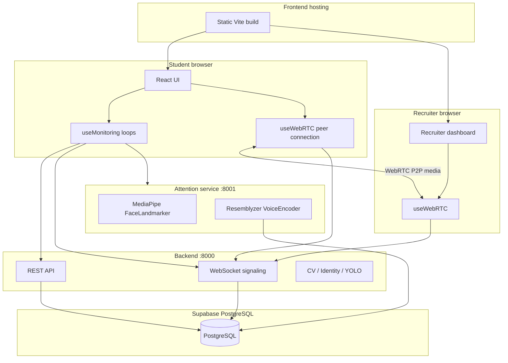

# HIRELENS — Technical Documentation

**HIRELENS** (InterviewAI) is an AI-proctored remote interview platform. Recruiters create monitored interviews; students join via WebRTC video calls while computer-vision and voice models detect integrity violations in real time.

**Repository:** [github.com/eryadavpraveen/HIRELENS](https://github.com/eryadavpraveen/HIRELENS)

---

## Table of contents

1. [System overview](#1-system-overview)
2. [Architecture](#2-architecture)
3. [Repository structure](#3-repository-structure)
4. [Technology stack](#4-technology-stack)
5. [Authentication & security](#5-authentication--security)
6. [Database](#6-database)
7. [Backend API (port 8000)](#7-backend-api-port-8000)
8. [Attention service (port 8001)](#8-attention-service-port-8001)
9. [WebRTC & signaling](#9-webrtc--signaling)
10. [Monitoring pipeline](#10-monitoring-pipeline)
11. [Violations & integrity score](#11-violations--integrity-score)
12. [Frontend application](#12-frontend-application)
13. [End-to-end user flows](#13-end-to-end-user-flows)
14. [Environment variables](#14-environment-variables)
15. [Local development](#15-local-development)
16. [Deployment](#16-deployment)
17. [Troubleshooting](#17-troubleshooting)

---

## 1. System overview

HIRELENS splits work across **four runtime components**:

| Component | Role | Default port |
|-----------|------|--------------|
| **Frontend** | React SPA — recruiter & student UI | 5173 (dev) / Vercel (prod) |
| **Backend** | FastAPI — REST API, WebSocket signaling, CV/identity/object ML | 8000 |
| **Attention service** | FastAPI — MediaPipe face landmarks + Resemblyzer voice | 8001 |
| **PostgreSQL** | Users, interviews, participants, violations, tokens, voiceprints | 5432 (Supabase) |

**Design principles:**

- **Video/audio** flows peer-to-peer via WebRTC (not through the server).
- **Signaling** (SDP offer/answer, ICE candidates) and **monitoring events** flow through the backend WebSocket relay.
- **Violation records** are persisted to PostgreSQL via REST; recruiters see live updates via WebSocket relay from the student browser.

---

## 2. Architecture



**Request paths during a live interview:**

1. Student webcam frames → backend (`/cv`, `/identity`, `/object-detection`) and attention service (`/attention/analyze`).
2. Student audio chunks → attention service (`/voice/verify`).
3. Detected events → `violationService.record()` (REST) + `sendMessage({ type: 'monitoring-event' })` (WebSocket).
4. Recruiter receives events via WebSocket → Redux `monitoringSlice` → dashboards.
5. Student and recruiter video → direct WebRTC; server only relays SDP/ICE.

---

## 3. Repository structure

```
HIRELENS/
├── frontend/                 # React + Vite + Redux
│   ├── src/
│   │   ├── pages/            # Student, Recruiter, Auth, Reports
│   │   ├── hooks/            # useWebRTC, useMonitoring, useAuth
│   │   ├── services/         # api, interview, monitoring, webrtc
│   │   ├── features/         # Redux slices
│   │   └── utils/            # violations.js (integrity engine)
│   └── vercel.json           # Vercel deploy config
├── backend/                  # Main FastAPI application
│   ├── app/
│   │   ├── api/              # Route handlers
│   │   ├── auth/             # JWT, dependencies
│   │   ├── models/           # SQLAlchemy models
│   │   ├── services/         # ML + business logic
│   │   └── database/         # Engine, migrations runner
│   └── migrations/           # SQL migrations + manifest
├── attention_service/        # MediaPipe + voice microservice
│   ├── services/             # face_landmarker, voice_verifier, etc.
│   ├── routers/              # voice_router
│   └── models/               # face_landmarker.task
├── deploy/                   # Oracle/VPS setup scripts
│   ├── oracle-vm-setup.sh
│   ├── nginx-hirelens.conf
│   └── render.yaml
└── docs/
    └── HIRELENS_DOCUMENTATION.md  # this file
```

---

## 4. Technology stack

| Layer | Technologies |
|-------|----------------|
| Frontend | React 19, Vite, Redux Toolkit, React Router, Tailwind, Framer Motion, Axios, WebRTC |
| Backend API | FastAPI, Uvicorn/Gunicorn, SQLAlchemy, python-jose (JWT), bcrypt |
| Backend ML | OpenCV, MediaPipe, DeepFace, face_recognition, Ultralytics YOLO, TensorFlow |
| Attention service | MediaPipe Tasks (Face Landmarker), Resemblyzer, PyTorch, SQLAlchemy |
| Database | PostgreSQL (Supabase) |
| Real-time | WebSocket (FastAPI), WebRTC (browser) |

---

## 5. Authentication & security

### 5.1 Registration & login

- **Register:** `POST /auth/register` — roles: `student` | `recruiter`.
- **Login:** `POST /auth/login` — returns `access_token` + `refresh_token`.
- **Refresh:** `POST /auth/refresh` — rotates refresh token.
- **Logout:** `POST /auth/logout` — revokes refresh token.
- **Me:** `GET /auth/me` — current user (JWT required).

Tokens are stored in `localStorage`:

- `hirelens_token` — access JWT (short-lived, default 15 min).
- `hirelens_refresh_token` — refresh token (default 30 days).

`frontend/src/services/api.js` attaches the access token to requests and auto-refreshes on 401.

### 5.2 JWT contents

Access token payload includes:

- `sub` — user UUID
- `role` — `student` | `recruiter`
- `type` — `access`

WebSocket connections authenticate via query param: `?token=<access_jwt>` (see `webrtcService.signalingUrl`).

### 5.3 Authorization rules (interviews)

| Action | Recruiter | Student |
|--------|-----------|---------|
| Create interview | Own account | — |
| List interviews | Own interviews | Joined interviews only |
| Get interview by ID | Owner | Participant only (after join) |
| Join preview (pre-join) | — | `GET /interviews/{id}/join-preview` |
| Join interview | — | `POST /interviews/{id}/join` |
| Complete interview | Owner, any reason | Participant, `TAB_SWITCH` only |
| Delete interview | Owner | — |
| View violations | Scoped by interview ownership / participation |

### 5.4 Password reset

- `POST /auth/forgot-password` — creates reset token (email if SMTP configured).
- `POST /auth/reset-password` — consumes token, updates password.

---

## 6. Database

### 6.1 Core tables

| Table | Purpose |
|-------|---------|
| `users` | Recruiters and students |
| `interviews` | Session metadata, `status`, `completed_at` |
| `participants` | Links `student_id` to `interview_id` after join |
| `violations` | Persisted monitoring events |
| `refresh_tokens` | Refresh token rotation |
| `password_reset_tokens` | One-time reset tokens |
| `voiceprints` | JSON embedding per `candidate_id` (interview id) |

### 6.2 Migrations

SQL migrations live in `backend/migrations/`. Applied automatically on backend startup via `migration_runner.py`, or manually:

```bash
cd backend
python scripts/apply_migrations.py
```

---

## 7. Backend API (port 8000)

### 7.1 Interview lifecycle

| Endpoint | Description |
|----------|-------------|
| `POST /interviews/` | Create interview (recruiter) |
| `GET /interviews/` | List interviews (role-scoped) |
| `GET /interviews/{id}` | Get interview (authorized) |
| `GET /interviews/{id}/join-preview` | Pre-join validation (student, safe fields) |
| `POST /interviews/{id}/join` | Create participant row (student) |
| `PATCH /interviews/{id}/complete` | Lock interview (`completed_at`) |
| `DELETE /interviews/{id}` | Cascade delete interview + cleanup |
| `GET /interviews/{id}/participants` | List participants |

**Interview completion** triggers WebSocket `interview-completed` to tear down rooms and notify clients.

### 7.2 Computer vision & identity

| Endpoint | Service | Purpose |
|----------|---------|---------|
| `POST /cv/check-face` | `face_detector` | NO_FACE / MULTIPLE_FACE |
| `POST /identity/verify-identity` | DeepFace / face_recognition | IDENTITY_MISMATCH |
| `POST /object-detection/check` | YOLO (`yolov8n.pt`) | Phone, book, laptop, person count |
| `POST /verification/upload` | File storage | Reference photo at verification |

### 7.3 Violations

| Endpoint | Description |
|----------|-------------|
| `POST /violations/` | Record violation (JWT + participant checks) |
| `GET /violations/interview/{id}` | List violations for interview |

### 7.4 Reports

| Endpoint | Description |
|----------|-------------|
| `GET /reports/` | List reports for recruiter's interviews |
| `GET /reports/{id}` | Report detail (violations as events) |
| `POST /reports/generate/{interview_id}` | Generate/snapshot report |

### 7.5 Signaling

| Endpoint | Description |
|----------|-------------|
| `WebSocket /ws/interview/{interview_id}?role=student\|recruiter&token=...` | Signaling + monitoring relay |

**Relayed message types:** `offer`, `answer`, `ice-candidate`, `monitoring-event`, `status-update`, `room-joined`, `peer-joined`, `peer-left`, `interview-completed`.

---

## 8. Attention service (port 8001)

Separate FastAPI process to isolate heavy MediaPipe + PyTorch from the main API.

### 8.1 Endpoints

| Endpoint | Description |
|----------|-------------|
| `GET /` | Health check |
| `POST /attention/analyze` | Face landmarks, head pose, eyes, mouth, attention |
| `POST /voice/register` | Store voiceprint embedding (JWT student) |
| `POST /voice/verify` | Compare live audio to stored embedding |
| `DELETE /voice/{candidate_id}` | Remove voiceprint |

### 8.2 Model loading

Models are **lazy-loaded** on first use (not at import):

- `face_landmarker.task` — absolute path via `Path(__file__)`
- `VoiceEncoder()` — Resemblyzer / PyTorch

Startup `lifespan` in `main.py` warms both models and logs failures with Python tracebacks.

### 8.3 Configuration

Loads env from `attention_service/.env`, then `backend/.env`, then project `.env` (`config.py`).

Requires: `DATABASE_URL`, `SECRET_KEY`, `ALGORITHM` (shared with backend for JWT validation on voice routes).

---

## 9. WebRTC & signaling

### 9.1 Connection flow

1. Both peers open WebSocket to `/ws/interview/{interview_id}?role=...&token=...`.
2. **Recruiter** is the offer initiator when a student is in the room.
3. Recruiter creates SDP offer → student answers → ICE candidates exchanged via WebSocket.
4. Media streams attach peer-to-peer (`RTCPeerConnection` in `useWebRTC.js`).

### 9.2 ICE configuration

Default STUN servers (Google) in `webrtcService.js`:

```javascript
{ urls: 'stun:stun.l.google.com:19302' }
```

Production may require TURN for restrictive networks (not bundled by default).

### 9.3 Media controls

- **Student & recruiter** can toggle local camera/mic via `track.enabled` (does not disconnect WebRTC).
- Implementation: `setVideoEnabled` / `setAudioEnabled` in `useWebRTC.js`.

---

## 10. Monitoring pipeline

Implemented in `frontend/src/hooks/useMonitoring.js`. Runs only when `active === true` (interview started, session not ended).

### 10.1 Parallel loops (independent async loops)

| Loop | Interval | API | Violation types |
|------|----------|-----|-----------------|
| Attention | 1s | Attention `/attention/analyze` | `HEAD_*`, `EYE_*`, `EYES_CLOSED` |
| Face | 2s | Backend `/cv/check-face` | `NO_FACE`, `MULTIPLE_PERSON_FACE` |
| Object | 3s | Backend `/object-detection/check` | `OBJECT_PHONE`, `OBJECT_BOOK`, `OBJECT_DEVICE`, `MULTIPLE_PERSON_YOLO` |
| Identity | 4s | Backend `/identity/verify-identity` | `IDENTITY_MISMATCH` |
| Voice | 1s cooldown | Attention `/voice/verify` | `VOICE_MISMATCH` |

### 10.2 `report()` function

Each violation:

1. Dedupes by type (5s window).
2. Sends `monitoring-event` over WebSocket to recruiter.
3. Calls `violationService.record()` → `POST /violations/`.
4. Does **not** show student toast popups (except fullscreen uses dedicated overlay).

### 10.3 Environment proctoring (student room)

Handled in `StudentInterviewRoom.jsx`:

| Event | Violation | Student UX |
|-------|-----------|------------|
| Tab hidden | `TAB_SWITCH` | Terminates interview, completes with reason |
| Window blur | `WINDOW_BLUR` | Silent (recorded only) |
| Window resize | `WINDOW_RESIZE` | Silent |
| Fullscreen exit | `FULLSCREEN_EXIT` | Blocking overlay + must return to fullscreen |

### 10.4 Status updates

`pushStatus()` sends `status-update` WebSocket messages (face, identity, object, attention, voice, etc.) to populate recruiter `MonitoringPanel`.

---

## 11. Violations & integrity score

### 11.1 Raw vs display types

Backend stores **raw** types (e.g. `MULTIPLE_PERSON_FACE`, `HEAD_LEFT`). Frontend `utils/violations.js` maps them to **11 recruiter categories**.

### 11.2 Integrity score

Computed client-side in `violationService.aggregate()` from the violation timeline:

- Category weights (e.g. multiple person = highest weight).
- `MULTIPLE_PERSON_FACE` + `MULTIPLE_PERSON_YOLO` deduped via `max()` per time window.
- Displayed in `IntegrityDashboard` on recruiter room.

### 11.3 Severity colors

Yellow → orange → red → purple by category (head/eye vs object/voice vs multiple person).

---

## 12. Frontend application

### 12.1 Key routes

| Path | Role | Page |
|------|------|------|
| `/login`, `/register` | Guest | Auth |
| `/student/dashboard` | Student | Dashboard |
| `/student/join` | Student | Join interview |
| `/student/interview/:id/verify` | Student | Photo + voice registration |
| `/student/interview/:id` | Student | Live interview room |
| `/recruiter/dashboard` | Recruiter | Dashboard |
| `/recruiter/create` | Recruiter | Create interview |
| `/recruiter/interview/:id` | Recruiter | Monitoring room |
| `/recruiter/reports/:id` | Recruiter | Report detail + PDF |

### 12.2 State management

| Redux slice | Purpose |
|-------------|---------|
| `authSlice` | User, login/logout |
| `interviewSlice` | Current interview, list, join |
| `monitoringSlice` | Live events, statuses, warnings |
| `reportSlice` | Report data |

### 12.3 Mock mode

`VITE_USE_MOCK=true` (default in dev example) uses `mockData.js` instead of API. **Production must set `VITE_USE_MOCK=false`.**

---

## 13. End-to-end user flows

### 13.1 Recruiter flow

```
Register (recruiter) → Login
  → Create interview (POST /interviews/)
  → Open monitoring room (/recruiter/interview/:id)
  → WebRTC connects when student joins
  → View live violations, integrity score, monitoring badges
  → End interview or generate report
```

### 13.2 Student flow

```
Register (student) → Login
  → Join interview (/student/join) — join-preview + POST join
  → Verification page — upload photo + register voice
  → Start interview room — fullscreen, WebRTC, monitoring loops
  → Only FULLSCREEN_EXIT shows blocking UI to student
  → Tab switch terminates session
```

### 13.3 Join circular dependency (fixed)

Students use `GET /interviews/{id}/join-preview` **before** participant row exists. Full `GET /interviews/{id}` requires participant membership after join.

---

## 14. Environment variables

### 14.1 Backend (`backend/.env`)

| Variable | Required | Description |
|----------|----------|-------------|
| `DATABASE_URL` | Yes | PostgreSQL connection string |
| `SECRET_KEY` | Yes | JWT signing key |
| `ALGORITHM` | No | Default `HS256` |
| `FRONTEND_URL` | Yes (prod) | CORS + password reset links |
| `ATTENTION_SERVICE_URL` | No | Default `http://localhost:8001` |
| `CORS_ORIGINS` | No | Extra comma-separated origins |
| `SMTP_*` | No | Email for password reset |

### 14.2 Attention service

Shares `DATABASE_URL`, `SECRET_KEY`, `ALGORITHM` via `backend/.env`.

### 14.3 Frontend (build-time `VITE_*`)

| Variable | Description |
|----------|-------------|
| `VITE_API_BASE_URL` | Backend REST base URL |
| `VITE_ATTENTION_SERVICE_URL` | Attention service URL |
| `VITE_WS_BASE_URL` | WebSocket base (same host as API) |
| `VITE_USE_MOCK` | `false` for production |

---

## 15. Local development

### 15.1 Prerequisites

- Python 3.11+, Node 18+
- PostgreSQL (or Supabase URL in `.env`)
- Virtualenv with backend + attention dependencies

### 15.2 Start services

```powershell
# Terminal 1 — Backend
cd backend
..\mediapipe_env\Scripts\uvicorn.exe app.main:app --reload --port 8000

# Terminal 2 — Attention (from attention_service directory)
cd attention_service
..\mediapipe_env\Scripts\python.exe -m uvicorn main:app --reload --port 8001

# Terminal 3 — Frontend
cd frontend
npm install
npm run dev
```

### 15.3 Frontend env (`frontend/.env`)

```env
VITE_API_BASE_URL=http://127.0.0.1:8000
VITE_ATTENTION_SERVICE_URL=http://localhost:8001
VITE_WS_BASE_URL=ws://127.0.0.1:8000
VITE_USE_MOCK=false
```

---

## 16. Deployment

| Piece | Recommended host |
|-------|------------------|
| Frontend | Vercel (`frontend/`, `vercel.json`) |
| Database | Supabase free tier |
| Backend + Attention | Oracle Always Free VM, or VPS (see `deploy/`) |

Scripts:

- `deploy/oracle-vm-setup.sh` — Ubuntu VM bootstrap
- `deploy/nginx-hirelens.conf` — Reverse proxy + WebSocket
- `deploy/render.yaml` — Render blueprint (ML may be tight on free tier)

See `frontend/.env.production.example` for Vercel variables.

---

## 17. Troubleshooting

| Issue | Check |
|-------|--------|
| Student join 403 | Use join-preview; ensure `POST /join` ran |
| WebRTC no video | HTTPS required in prod; STUN/TURN; both peers connected |
| Monitoring not on recruiter | `receiveMonitoring: true` on recruiter `useWebRTC` |
| Attention `Aborted!` | Start from `attention_service/` cwd; lazy model init |
| CORS errors | Set `FRONTEND_URL` + `CORS_ORIGINS` on backend/attention |
| Login fails on Vercel | `VITE_API_BASE_URL` must point to live backend, not localhost |

---

## Document history

| Date | Notes |
|------|-------|
| 2026-06 | Initial documentation — Phase 2 auth, join-preview, lazy attention startup, student silent violations, recruiter media toggles |

For questions or updates, edit this file in `docs/HIRELENS_DOCUMENTATION.md`.
